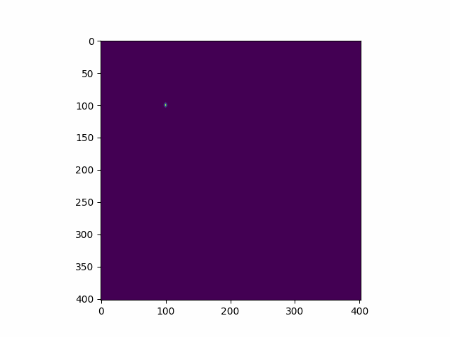

## Py2DFDTD

A Python implementation of two-dimensional, Finite Difference Time Domain (FDTD) simulation of elastic wave propagation in solids. Uses Numba's JIT compiler to accelerate derivative calculations. 

# Features:
1. User-defined materials
2. User-defined source / emitter functions
3. Multi-Material simulations 
4. Arbitary numbers of sources, materials, reflectors
5. Variable simulation area size
6. Variable node size
7. Variable output intervals
8. High performance Numba NJIT support

# Usage:
See Jupyter notebook examples

# Requirements:
- FDTDElastic:
  - Numpy
  - Numba
- FDTDElastic_Examples:
  - Numpy
  - Matplotlib
  - FDTDElastic 

Algorithm based on Matlab example here:
https://github.com/ovcharenkoo/WaveProp_in_MATLAB
